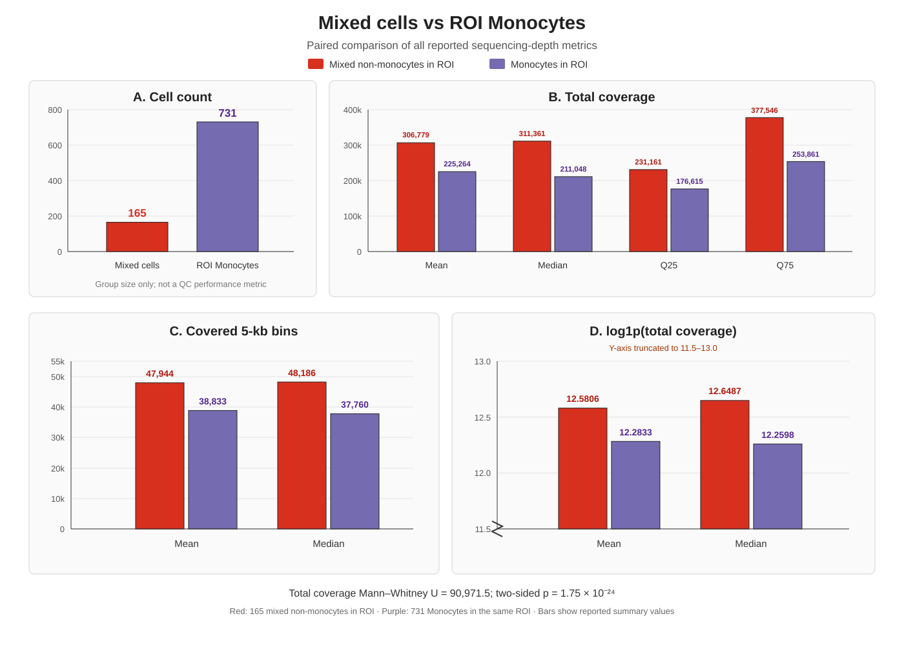

# MethylVI 20260816 当前流程报告

更新日期：2026-08-23

## 1. 当前分析范围

当前正式分析不再使用单一 Scanpy 白名单或 4 个 Methscan 阈值变体，而是分别使用 **Scrublet** 和 **DoubletFinder** clean-cell 名单运行两套独立 MethylVI 分析。两套结果用于评估 doublet 过滤方法对甲基化潜空间、细胞群结构和下游结论的影响。

分析包含 10 个样本（IR01–IR05、NR01–NR05）。cell type 和 IR/NR condition 不传入 MethylVI 核心模型；这些标签仅用于结果解释、分组绘图和 supervised UMAP。

## 2. 两套输入细胞

| 分支 | Scanpy clean 后的定义 | Methscan 300k–1.2M QC 后细胞数 | 样本数 |
|---|---|---:|---:|
| Scrublet | 剔除 Scrublet doublets、Low-RNA ambient-Ig monocytes 和 Platelets | **4,942** | 10 |
| DoubletFinder | 剔除 DoubletFinder doublets、Low-RNA ambient-Ig monocytes 和 Platelets | **5,050** | 10 |

Methscan QC 使用：

```text
min_sites = 300,000
max_sites = 1,200,000
min_meth  = 55
max_meth  = none
```

两套分支的白名单、MCDS、MethylVI 输入、模型、embedding 和图片目录完全隔离。不同分支的文件不能交叉复用。

## 3. 当前分析流程

```text
方法特异的 Scanpy clean-cell 名单
→ Methscan QC headers（300k–1.2M）
→ ALLC staging
→ 5-kb CGN MCDS
→ ENCODE GRCh38 blacklist
→ 方法特异的低频 feature 阈值重算
→ 约 100k 个 5-kb features
→ 从逐细胞 ALLC 重建整数 mc/cov
→ H5MU + sample/condition/cell-type 元数据
→ sample_id batch 的 MethylVI
→ 20 维 latent
→ neighbors=15、UMAP、Leiden resolution=1.0
→ supervised UMAP
→ sequencing depth、overall mCG 和 arithmetic-mean mCG
```

这里的 `100k` 是目标 feature 数，不是 100-kb genomic window；每个输入 feature 仍为 5 kb。实际保留数由当前细胞集的非零分布计算，并由脚本硬检查。

## 4. 输入构建与 ALLCools 参数

ALLCools H5AD 中的 `X` 是处理后的 hypo-score，不能直接作为 MethylVI 计数。流程从逐细胞 ALLC 重新聚合：

```text
mc  = methylated count
cov = total coverage count
```

构建时验证 `mc ≤ cov`，根据最大 coverage 选择整数 dtype，写出包含 `mc/cov` layers 的 H5MU，并回读核验形状、细胞顺序和元数据。

| 参数 | 当前值 |
|---|---:|
| genome / context | GRCh38 / `CGN` |
| feature size | 5 kb |
| blacklist | ENCODE `ENCFF356LFX` |
| blacklist overlap fraction | 0.2 |
| hypo-score binarize cutoff | 0.95 |
| feature profile | 100k |
| batch key | `sample_id` |

`MVI_HYPO_PERCENT` 会在每套细胞名单上重新计算，而不是跨分支使用固定值。

## 5. MethylVI 参数

| 参数 | 当前值 |
|---|---:|
| model | `scvi.external.METHYLVI` |
| likelihood | `betabinomial` |
| dispersion | `region` |
| latent dimension | 20 |
| hidden dimension / layers | 128 / 1 |
| batch size | 32 |
| maximum epochs | 500 |
| early stopping | 开启 |
| seed | 0 |
| accelerator | CPU |
| neighbors | 15 |
| Leiden resolution | 1.0 |
| supervised target | `cell_type` |
| supervised target weights | 0.2、0.5、0.7、0.9 |
| supervised min_dist | 0.5 |

## 6. 计算资源与完成状态

两套完整任务各申请 60 CPU 和 184,320 MB（约 180 GiB）内存，并分别运行于独立节点。

| 分支 | 初次任务 | 结果 | 补跑任务 | 最终状态 |
|---|---:|---|---:|---|
| Scrublet | `167490` | 模型、latent、普通和 supervised UMAP 已保存；postprocess 因重复 `cell_type` 列失败 | `167505` | **SUCCEEDED** |
| DoubletFinder | `167491` | 模型、latent、普通和 supervised UMAP 已保存；postprocess 因重复 `cell_type` 列失败 | `167506` | **SUCCEEDED** |

重复列问题已修复。`167505` 和 `167506` 复用已训练模型和 embedding，仅重新运行 sequencing depth、overall mCG 和 arithmetic-mean mCG，均以退出码 0 完成。最终两套分析均已完成，不需要重新训练。

实测 postprocess 峰值内存约 2.5 GB，20 CPU 作业即可完成；完整建模阶段仍保留 60 CPU / 180 GiB 的提交配置。

## 7. 输出位置

Scrublet ALLCools 与 MethylVI 输出：

```text
/share/LCZX_Data/data/allcools/methylvi_5kb_300k_blacklist_f0p2_scanpy20260815_30pc20nn_scrublet_clean_300k_1200k_100k/
/share/LCZX_Data/data/allcools/methylVI_results_300k_blacklist_f0p2_scanpy20260815_30pc20nn_scrublet_clean_300k_1200k_100k/
```

DoubletFinder ALLCools 与 MethylVI 输出：

```text
/share/LCZX_Data/data/allcools/methylvi_5kb_300k_blacklist_f0p2_scanpy20260815_30pc20nn_doubletfinder_clean_300k_1200k_100k/
/share/LCZX_Data/data/allcools/methylVI_results_300k_blacklist_f0p2_scanpy20260815_30pc20nn_doubletfinder_clean_300k_1200k_100k/
```

仓库图片按分支写入：

```text
MethylVI/20260816/Results/<variant>/01_before_methylvi/
MethylVI/20260816/Results/<variant>/02_after_methylvi/
MethylVI/20260816/Results/<variant>/03_supervised_umap/
```

下载到本地的当前图片快照位于 `MethylVI/20260816/Results/20260823/`。

## 8. 注释与可视化解释

普通 UMAP 完全基于 MethylVI latent。supervised UMAP 是额外的标签引导可视化，不改变 MethylVI 模型、latent 或普通 UMAP。不同 `target_weight` 只改变 supervised UMAP 对 cell-type 标签的依赖强度。

测序深度和 mCG 图包括：

- 每细胞 total coverage 和 covered bins；
- 各 cell type 的 depth boxplot 和汇总表；
- overall mCG：`sum(mc)/sum(cov)`；
- arithmetic-mean mCG：各已覆盖 feature 的 `mc/cov` 算术平均。

postprocess 中设置 `MVI_FILTER_MAX_SITES=none` 只用于避免对已经固定的 Methscan-QC 白名单再次执行上限过滤，不会把未通过 1.2M 上限的细胞重新加入分析。

## 9. Monocyte 岛左侧杂色细胞的测序深度审查

本节记录 Scrublet 分支、100k profile、supervised UMAP `target_weight=0.5` 的专项检查。“杂色细胞”是基于 UMAP 位置的操作性名称，不代表新的细胞类型。

最终 ROI：

```text
34.0 ≤ UMAP1 ≤ 39.5
-3.0 ≤ UMAP2 ≤ 2.0
```

分组：

- 杂色细胞：ROI 内且 `cell_type != Monocytes`。
- ROI Monocytes：ROI 内且 `cell_type == Monocytes`。
- 全部 Monocytes：Scrublet MethylVI 数据中的全部 Monocytes。
- ROI 外 Monocytes：全部 Monocytes 中不在 ROI 内的细胞。

### 9.1 杂色细胞（红色）

ROI 内共有 **165 个杂色细胞**。它们来自多个已注释免疫细胞类型，应视为异质细胞集合。

| 指标 | 数值 |
|---|---:|
| 细胞数 | **165** |
| total coverage 均值 / 中位数 | 306,778.99 / **311,361** |
| total coverage Q25–Q75 | 231,161–377,546 |
| covered bins 均值 / 中位数 | 47,944.29 / **48,186** |
| log1p total coverage 均值 / 中位数 | 12.580610 / 12.648712 |

### 9.2 Monocytes（紫色对照）

| 分组 | 细胞数 | total coverage 均值 | 中位数 | Q25–Q75 | covered bins 均值 | 中位数 |
|---|---:|---:|---:|---:|---:|---:|
| ROI 内 Monocytes | **731** | 225,263.50 | **211,048** | 176,614.5–253,861 | 38,832.51 | **37,760** |
| 全部 Monocytes | **2,355** | 168,238.15 | **149,278** | 127,705–188,235 | 31,046.26 | **28,735** |
| ROI 外 Monocytes | **1,624** | 142,569.73 | **135,594.5** | 121,909.75–154,556.25 | 27,541.49 | **26,630.5** |

### 9.3 统计比较

| 比较 | Mann–Whitney U | 双侧 P 值 |
|---|---:|---:|
| 杂色细胞 vs ROI 内 Monocytes | 90,971.5 | 1.7502 × 10^-24 |
| 杂色细胞 vs 全部 Monocytes | 347,032.5 | 4.0866 × 10^-64 |

杂色细胞的 total coverage 中位数比 ROI 内 Monocytes 高约 **47.5%**，covered bins 中位数高约 **27.6%**；其 total coverage 中位数约为全部 Monocytes 的 **2.09 倍**。

### 9.4 各项指标的双柱对比图



每项指标均使用两根并排柱：红色为 ROI 内 165 个杂色细胞，紫色为同一 ROI 内 731 个 Monocytes。四个面板依次比较细胞数、total coverage 的均值/中位数/Q25/Q75、covered bins 的均值/中位数，以及 log1p total coverage 的均值/中位数。细胞数只是两组样本量，不代表 QC 优劣；log1p 面板为显示较小差异使用了明确标注的截断纵轴。Mann–Whitney 检验基于逐细胞 total coverage，而不是基于汇总柱高计算。

这些红色细胞不是低测序深度造成的低质量细胞。相反，它们整体具有更高的 feature coverage。但该比较受细胞类型组成影响，不能证明测序深度导致其 UMAP 位置，也不支持仅依据位置或深度删除这些细胞。进一步检验应在相同 cell type 内、按样本分层比较 ROI 内外细胞。

这里的 `total coverage` 是最终约 100k 个 5-kb MethylVI 输入 features 上的 coverage 总和，不等同于原始 FASTQ reads。

专项结果：

```text
/share/home/rzli/scLC_ICI_PBMC/MethylVI/20260816/Results/blacklist_f0p2_scanpy20260815_30pc20nn_scrublet_clean_300k_1200k_100k/03_supervised_umap/mixed_monocyte_depth_target_weight_0p5/
```

`mixed_non_monocyte_cells.tsv.gz` 保存 165 个红色细胞的逐细胞名单；`all_cells_in_roi.tsv.gz` 保存 ROI 内杂色细胞和 Monocytes；`sequencing_depth_summary.tsv` 和 `sequencing_depth_tests.tsv` 保存汇总统计与检验。

## 10. 统计注意事项与当前结论

1. `sample_id` 与 IR/NR condition 完全绑定。以 `sample_id` 做 batch correction 可能同时削弱真实 IR/NR 信号。
2. supervised UMAP 是解释性图形，不是额外训练模型，也不应用于独立证明细胞类型。
3. 两套分支的细胞数量和 feature 集不同；比较时应同时报告分支、细胞数、profile 和参数。
4. 当前两套 MethylVI 分析均已完成。主结果应以 Scrublet 与 DoubletFinder 的 100k 分支为准。
5. 旧的 4,998/5,014-cell 单白名单结果及 4 变体试验只作历史参考，不应混入当前结论。

## 11. 可复现入口

```bash
cd /share/home/rzli/scLC_ICI_PBMC

# 同时提交两套完整分析
bash MethylVI/20260816/Scripts/16_submit_methscan_qc_methods.sh

# 输入检查
bash MethylVI/20260816/Scripts/15_run_methscan_qc_method.sh scrublet check 100k
bash MethylVI/20260816/Scripts/15_run_methscan_qc_method.sh doubletfinder check 100k

# 已训练结果的后处理补跑
bash MethylVI/20260816/Scripts/15_run_methscan_qc_method.sh scrublet postprocess 100k
bash MethylVI/20260816/Scripts/15_run_methscan_qc_method.sh doubletfinder postprocess 100k
```

脚本细节、作业查询和文件说明见 [Scripts README](Scripts/README.md)。
